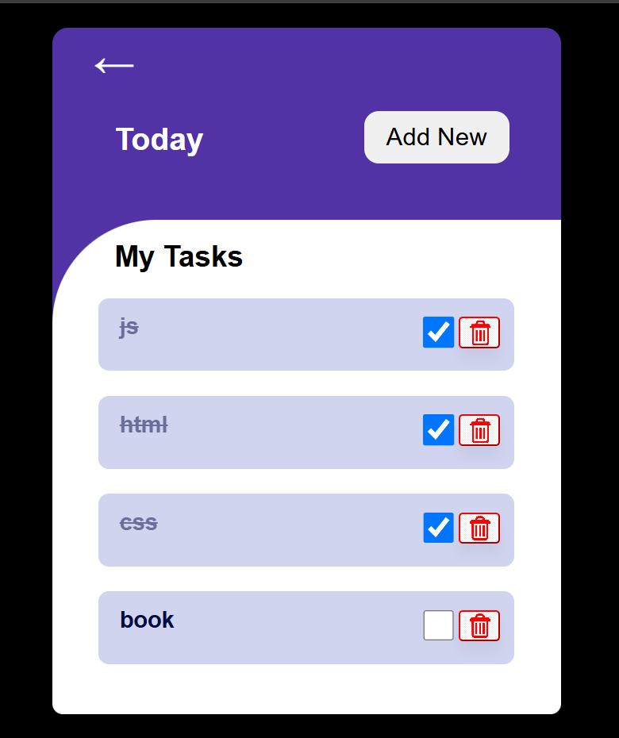

# To-Do List

## To-Do List is a responsive task management web application built with HTML, CSS, and JavaScript.

## Users can dynamically add, complete, and delete tasks, with a maximum limit of four active tasks. The project focuses on DOM manipulation, event handling, dynamic element creation, and interactive UI development.

## In the JavaScript section, tasks are created dynamically in the DOM. This means that whenever a new task is added, its required elements, such as the li, text, checkbox, and delete button, are created using JavaScript.

# 🎯 Purpose

- DOM Manipulation
- Event Handling
- Dynamic Element Creation
- Adding and Removing Elements
- Form/Input Validation

# ✨ Features

1. ➕ Add a new task
2. 🔢 Maximum limit of 4 tasks
3. ☑️ Mark a task as completed
4. ⛔ Strike through a task after completion
5. 🗑️ Delete each task individually
6. 🚫 Prevent adding empty tasks
7. 🎨 Custom UI design with CSS
8. ⚡ Dynamically create and manage tasks with JavaScript

# 🛠️ Built With

- HTML5
- CSS3
- JavaScript

# 📸 Screenshot

# 📄 LICENCE

MIT
